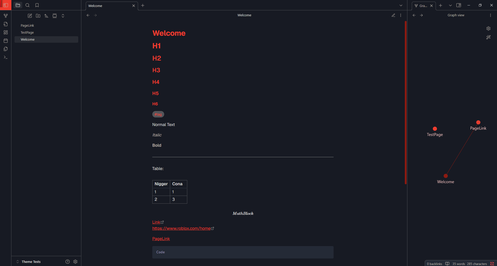

# Obsidian-MinimalRed

**Minimal Red** is an [Obsidian](https://obsidian.md/) theme,compatible with PCs, tablets, and mobile devices.

# Theme Installation
To install the theme

-Clone this repository in your .themes directory
-Open Obsidian Settings
-Go to Appearance and click Default
-Select Minimal-Red from the list of themes
